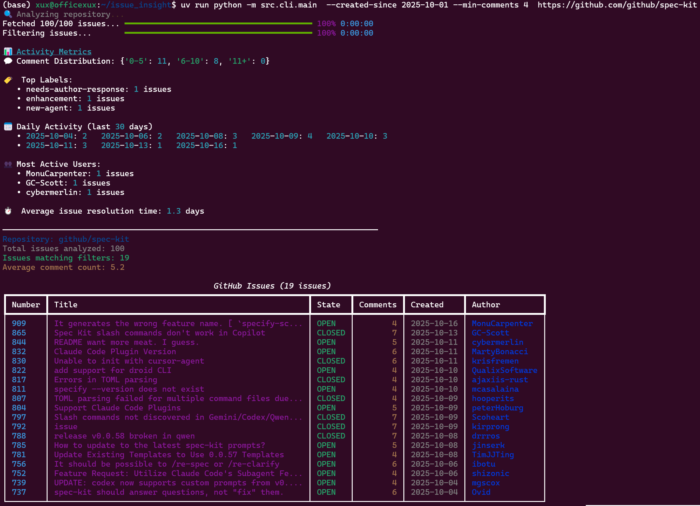

# GitHub Project Activity Analyzer

A powerful CLI tool for analyzing GitHub repository issues to understand project activity, identify community hotspots, and assess engagement patterns.

## Features

- **Comprehensive Issue Filtering**: Filter by comment count (--min-comments, --max-comments), state (--state), labels (--label), assignees (--assignee), and date ranges (--created-since, --created-until, --updated-since, --updated-until)
- **Flexible Label/Assignee Logic**: Support for ANY or ALL matching logic for labels and assignees
- **Activity Metrics**: Display detailed activity metrics with --metrics flag
- **Comment Analysis**: Include actual comment content with --include-comments (may result in additional API calls)
- **Multiple Output Formats**: Export results in table, JSON (--format json), or CSV (--format csv) format
- **Authentication Support**: Use GitHub API token for higher rate limits (via --token or GITHUB_TOKEN env var)
- **Advanced Options**: Control result limits (--limit), verbose logging (--verbose), and version display (--version)
- **Performance Optimized**: Efficient API usage and result limiting for handling large repositories

## Demo



## Quick Start

### Installation

```bash
pip install issue-analyzer
```

### Basic Usage

```bash
# Analyze issues with minimum 5 comments (default: 100 issues, table format)
issue-analyzer --min-comments 5 https://github.com/facebook/react

# Filter by state and labels (multiple labels use ANY logic by default)
issue-analyzer --state open --label bug --label enhancement https://github.com/microsoft/vscode

# Show detailed activity metrics
issue-analyzer --metrics --limit 50 https://github.com/your-org/issue-finder

# Use ALL label logic (issues must have ALL specified labels)
issue-analyzer --all-labels --label bug --label "good first issue" https://github.com/facebook/react

# Filter by assignees and date range
issue-analyzer --assignee octocat --created-since 2024-01-01 --updated-until 2024-12-31 https://github.com/owner/repo

# Export to JSON format with comment content included
issue-analyzer --include-comments --format json --limit 10 https://github.com/owner/repo > issues.json

# Export to CSV for spreadsheet analysis
issue-analyzer --format csv --min-comments 10 https://github.com/owner/repo > issues.csv
```

### Authentication

For higher rate limits, set a GitHub personal access token:

```bash
export GITHUB_TOKEN=your_token_here
```

## Requirements

- Python 3.11+ (supports 3.11, 3.12, 3.13)
- GitHub personal access token (optional, for higher rate limits)

## Dependencies

- PyGithub >= 2.1.0
- Typer >= 0.7.0
- Pydantic >= 2.0.0
- Rich >= 13.0.0

## Documentation

See the [Quickstart Guide](specs/001-github-issue/quickstart.md) for detailed usage examples and advanced features.

## License

MIT License - see [LICENSE](LICENSE) file for details.

## Contributing

Contributions are welcome! Please read our contributing guidelines and submit pull requests to our repository.
