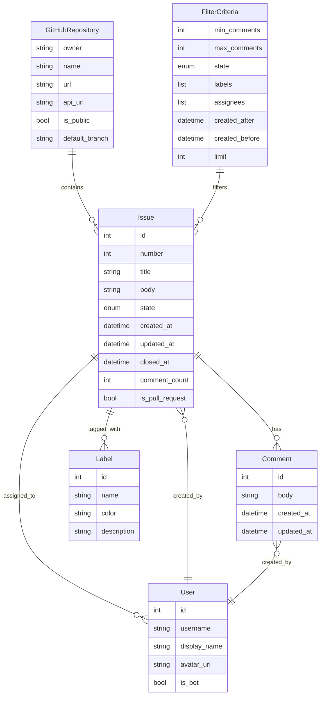

# Data Model: GitHub Project Activity Analyzer

**Date**: 2025-10-14
**Feature**: GitHub Project Activity Analyzer
**Branch**: 001-github-issue

## Core Entities

### 1. GitHub Repository
Represents a GitHub project that serves as the source for issue data.

```python
class GitHubRepository:
    """
    Represents a GitHub repository for issue analysis.

    Attributes:
        owner (str): Repository owner username
        name (str): Repository name
        url (str): Full repository URL
        api_url (str): GitHub API URL for the repository
        is_public (bool): Whether repository is public (always True for our scope)
        default_branch (str): Default branch name (e.g., "main", "master")
    """

    owner: str  # e.g., "facebook"
    name: str   # e.g., "react"
    url: str    # e.g., "https://github.com/facebook/react"
    api_url: str  # e.g., "https://api.github.com/repos/facebook/react"
    is_public: bool = True  # Scope limited to public repositories
    default_branch: str  # e.g., "main"
```

### 2. Issue
Represents a single GitHub issue with comprehensive metadata.

```python
class Issue:
    """
    Represents a GitHub issue with all relevant metadata for analysis.

    Attributes:
        id (int): Unique GitHub issue ID
        number (int): Issue number within repository
        title (str): Issue title
        body (str): Issue body text (may be None)
        state (IssueState): Current state (open/closed)
        created_at (datetime): Creation timestamp
        updated_at (datetime): Last update timestamp
        closed_at (Optional[datetime]): Closure timestamp (if closed)
        author (User): User who created the issue
        assignees (List[User]): Users assigned to the issue
        labels (List[Label]): Labels applied to the issue
        comment_count (int): Number of comments
        comments (List[Comment]): Comment content (if requested)
        reactions (ReactionSummary): Reactions summary
        milestone (Optional[Milestone]): Associated milestone
        is_pull_request (bool): Whether this is a pull request (excluded from analysis)
    """

    id: int
    number: int
    title: str
    body: Optional[str]
    state: IssueState  # enum: OPEN, CLOSED
    created_at: datetime
    updated_at: datetime
    closed_at: Optional[datetime]
    author: User
    assignees: List[User]
    labels: List[Label]
    comment_count: int
    comments: List[Comment]  # Only included when --include-comments flag is used
    reactions: ReactionSummary
    milestone: Optional[Milestone]
    is_pull_request: bool = False  # Filter out pull requests from analysis

class IssueState(Enum):
    OPEN = "open"
    CLOSED = "closed"
```

### 3. Comment
Represents individual comments on issues with metadata.

```python
class Comment:
    """
    Represents a comment on a GitHub issue.

    Attributes:
        id (int): Unique comment ID
        body (str): Comment text content
        author (User): User who wrote the comment
        created_at (datetime): Creation timestamp
        updated_at (datetime): Last edit timestamp
        reactions (ReactionSummary): Reactions on this comment
        issue_id (int): Reference to parent issue
    """

    id: int
    body: str
    author: User
    created_at: datetime
    updated_at: datetime
    reactions: ReactionSummary
    issue_id: int
```

### 4. User
Represents GitHub users with minimal relevant information.

```python
class User:
    """
    Represents a GitHub user with minimal relevant information.

    Attributes:
        id (int): Unique user ID
        username (str): GitHub username
        display_name (Optional[str]): Display name (may differ from username)
        avatar_url (str): URL to user's avatar image
        is_bot (bool): Whether this is a bot account
    """

    id: int
    username: str
    display_name: Optional[str]
    avatar_url: str
    is_bot: bool = False
```

### 5. Label
Represents GitHub issue labels for categorization.

```python
class Label:
    """
    Represents a GitHub issue label.

    Attributes:
        id (int): Unique label ID
        name (str): Label name (e.g., "bug", "enhancement")
        color (str): Hex color code (e.g., "#ff0000")
        description (Optional[str]): Label description
    """

    id: int
    name: str
    color: str
    description: Optional[str]
```

### 6. Filter Criteria
Represents user-defined filtering conditions for issues with enhanced capabilities.

```python
class FilterCriteria:
    """
    Represents filtering criteria for issue analysis with comprehensive options.

    Attributes:
        min_comments (Optional[int]): Minimum comment count filter (inclusive)
        max_comments (Optional[int]): Maximum comment count filter (inclusive)
        state (Optional[IssueState]): Issue state filter (open/closed/all)
        labels (List[str]): Filter by specific label names (all must match if any_labels=False)
        assignees (List[str]): Filter by assignee usernames (any if any_assignees=True)
        created_since (Optional[datetime]): Created date lower bound (inclusive)
        created_until (Optional[datetime]): Created date upper bound (inclusive)
        updated_since (Optional[datetime]): Updated date lower bound (inclusive)
        updated_until (Optional[datetime]): Updated date upper bound (inclusive)
        limit (Optional[int]): Maximum number of issues to return (None for unlimited)
        any_labels (bool): If True, match any label; if False, match all labels
        any_assignees (bool): If True, match any assignee; if False, match all assignees
        include_comments (bool): Whether to fetch comment content
        page_size (int): API pagination batch size for performance tuning
    """

    min_comments: Optional[int] = None
    max_comments: Optional[int] = None
    state: Optional[IssueState] = None
    labels: List[str] = []
    assignees: List[str] = []
    created_since: Optional[datetime] = None
    created_until: Optional[datetime] = None
    updated_since: Optional[datetime] = None
    updated_until: Optional[datetime] = None
    limit: Optional[int] = None  # None for unlimited, N for限制N个结果
    any_labels: bool = True  # Default: match any specified label
    any_assignees: bool = True  # Default: match any specified assignee
    include_comments: bool = False
    page_size: int = 100  # GitHub API default, configurable for performance
```

### 7. Activity Metrics
Represents aggregated metrics about repository activity.

```python
class ActivityMetrics:
    """
    Represents aggregated activity metrics for a repository.

    Attributes:
        total_issues_analyzed (int): Total number of issues processed
        issues_matching_filters (int): Number of issues matching filter criteria
        average_comment_count (float): Average comments per issue
        comment_distribution (Dict[str, int]): Distribution of comment counts by range
        top_labels (List[LabelCount]): Most frequently used labels
        activity_by_month (Dict[str, int]): Issue activity grouped by month
        most_active_users (List[UserActivity]): Users with most activity
        average_issue_resolution_time (Optional[timedelta]): Average time to close issues
    """

    total_issues_analyzed: int
    issues_matching_filters: int
    average_comment_count: float
    comment_distribution: Dict[str, int]  # e.g., {"1-5": 100, "6-10": 50, "11+": 25}
    top_labels: List['LabelCount']
    activity_by_month: Dict[str, int]  # e.g., {"2024-01": 45, "2024-02": 67}
    most_active_users: List['UserActivity']
    average_issue_resolution_time: Optional[timedelta]

class LabelCount:
    label_name: str
    count: int

class UserActivity:
    username: str
    issues_created: int
    comments_made: int
```

### 8. Progress Tracking
Represents progress information for long-running operations.

```python
class ProgressPhase(Enum):
    """
    Represents different phases of the analysis process.
    """
    INITIALIZING = "initializing"
    VALIDATING_REPOSITORY = "validating_repository"
    FETCHING_ISSUES = "fetching_issues"
    FILTERING_ISSUES = "filtering_issues"
    RETRIEVING_COMMENTS = "retrieving_comments"
    CALCULATING_METRICS = "calculating_metrics"
    GENERATING_OUTPUT = "generating_output"
    COMPLETED = "completed"

class ProgressInfo:
    """
    Represents progress tracking information for analysis operations.

    Attributes:
        current_phase (ProgressPhase): Current processing phase
        total_items (int): Total items to process in current phase
        processed_items (int): Number of items processed so far
        phase_description (str): Human-readable description of current phase
        elapsed_time_seconds (float): Time elapsed for current phase
        estimated_remaining_seconds (Optional[float]): Estimated remaining time
        rate_limit_info (Optional[Dict[str, int]]): GitHub API rate limit info
        errors encountered (List[str]): Errors encountered during processing
    """

    current_phase: ProgressPhase
    total_items: int = 0
    processed_items: int = 0
    phase_description: str = ""
    elapsed_time_seconds: float = 0.0
    estimated_remaining_seconds: Optional[float] = None
    rate_limit_info: Optional[Dict[str, int]] = None
    errors_encountered: List[str] = []

    @property
    def progress_percentage(self) -> float:
        """Calculate progress percentage for current phase."""
        if self.total_items == 0:
            return 0.0
        return (self.processed_items / self.total_items) * 100.0

class PaginationInfo:
    """
    Represents pagination state for GitHub API operations.

    Attributes:
        page_size (int): Number of items per page
        current_page (int): Current page number (1-indexed)
        total_pages (Optional[int]): Total estimated pages (None if unknown)
        items_per_page (int): Actual items returned per page
        has_more (bool): Whether more pages are available
        next_page_url (Optional[str]): URL for next page (if available)
    """

    page_size: int
    current_page: int = 1
    total_pages: Optional[int] = None
    items_per_page: int = 0
    has_more: bool = True
    next_page_url: Optional[str] = None
```

### 9. Output Format
Represents different output formats for analysis results.

```python
class OutputFormat(Enum):
    JSON = "json"
    CSV = "csv"
    TABLE = "table"

class AnalysisResult:
    """
    Represents the complete analysis result for output.

    Attributes:
        repository (GitHubRepository): Repository information
        filter_criteria (FilterCriteria): Applied filters
        issues (List[Issue]): Filtered issues (with comments if requested)
        metrics (ActivityMetrics): Aggregated activity metrics
        generated_at (datetime): When analysis was performed
        processing_time_seconds (float): Total processing time
        pagination_info (PaginationInfo): Pagination details from API calls
        progress_summary (Dict[str, Any]): Summary of progress across all phases
        warnings (List[str]): Non-fatal warnings during processing
        errors (List[str]): Fatal errors that may have interrupted processing
    """

    repository: GitHubRepository
    filter_criteria: FilterCriteria
    issues: List[Issue]
    metrics: ActivityMetrics
    generated_at: datetime
    processing_time_seconds: float
    pagination_info: PaginationInfo
    progress_summary: Dict[str, Any]
    warnings: List[str] = []
    errors: List[str] = []
```

## Relationships



## Data Validation Rules

### Input Validation
- Repository URL must be valid GitHub URL format
- Comment count filters must be non-negative integers
- Limit must be positive integer (>= 1) when specified
- Date filters must be valid ISO 8601 dates
- Label and assignee filters must be non-empty strings
- Output format must be one of supported options

### Limit Validation
- `--limit` parameter must be >= 1 when specified
- When `--limit` is not specified, returns all matching issues (unlimited)
- Performance warning when limit > 1000
- Memory considerations enforced for very large limits

### Limit Processing Logic
```python
def apply_limit(issues: List[Issue], limit: Optional[int]) -> List[Issue]:
    """
    Apply limit to filtered issues list.

    Args:
        issues: List of filtered issues
        limit: Maximum number of issues to return (None for unlimited)

    Returns:
        Limited list of issues

    Raises:
        ValueError: If limit < 1 when specified
    """
    if limit is not None and limit < 1:
        raise ValueError("Limit must be at least 1 when specified")
    return issues[:limit] if limit is not None else issues
```

### Data Integrity
- Issue numbers must be unique within repository
- Comment counts must match actual comments array length
- Creation dates must precede update dates
- Closed dates must precede update dates when present
- Pull requests must be excluded from issue analysis

### API Response Validation
- All required fields must be present in API responses
- Datetime strings must parse to valid datetime objects
- User data must include at minimum username and ID
- Label data must include name and color

## State Transitions

### Issue States
```
OPEN -- (closed) --> CLOSED
CLOSED -- (reopened) --> OPEN
```

### Processing States
```
FETCHING_ISSUES -- (pagination complete) --> FILTERING_ISSUES
FILTERING_ISSUES -- (filters applied) --> CALCULATING_METRICS
CALCULATING_METRICS -- (complete) --> GENERATING_OUTPUT
```

## Performance Considerations

### Memory Management
- Use generators for large issue collections
- Lazy loading of comment content when requested
- Stream output to avoid loading all data into memory

### Caching Strategy
- Cache repository metadata for 1 hour
- Cache issue lists for 15 minutes
- Cache comment content for 5 minutes (when requested)

### Pagination Handling
- Process issues in batches of 100 (GitHub API limit)
- Use cursor-based pagination for consistency
- Track pagination state for potential resume capability

## Error Handling

### API Errors
- Rate limit exceeded: Wait and retry with exponential backoff
- Repository not found: Clear error message with URL validation
- Network timeout: Retry with increasing timeout periods
- Authentication failure: Clear instructions for token setup

### Data Validation Errors
- Invalid repository format: Specific error message
- Invalid filter values: Type-specific validation messages
- Malformed dates: ISO 8601 format requirement

### Processing Errors
- Comment retrieval failure: Continue with error indicator
- Large dataset handling: Progress indicators and graceful degradation
- Memory limits: Streaming fallback with reduced functionality